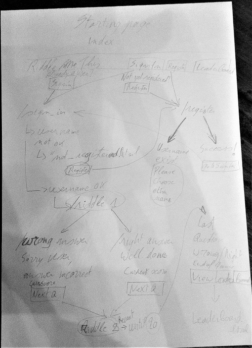
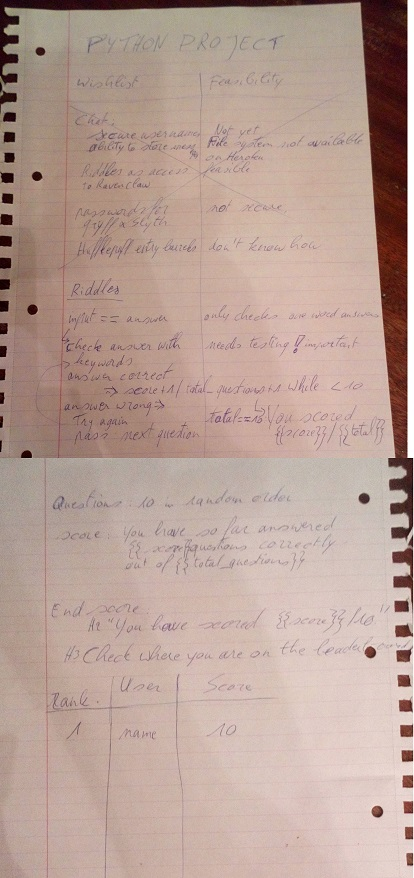

# [Facing The Sphinx](https://facing-the-sphinx.herokuapp.com/)

This riddles game was created as a Python-based project for Code Institute's Full Stack Software Developer bootcamp.

The theme came from many hours growing up reading Greek mythology and fantasy novels like the Never-Ending Story and Harry Potter which feature amazing mythical creatures such as the famous (or is that infamous?) Sphinx. This majestic creature, a sometimes-winged lion with a human head, has long held a place in humanity's collective imagination, so it only seemed fit to feature it in a game of riddles, which it delights in.

If you wish to play, the title above is a link to the active application on Heroku. Good luck!

## UX

### User Stories

- As a visitor, I would like to know more about the theme of the website. I may not know of the Sphinx and its role in mythology / fantasy, so some explanation would be nice.
- As a visitor, I would like to have a look at the scoreboard to see how other players have done; it would be a good gauge to find out how difficult the game is before I play.
- As a new player, I would like to register a username so I can play the game.
- As an existing player, I would like to be able to simply sign in with my existing username instead of having to make up a new one every time.
- As a player, I would like to answer some riddles, after all that's what the game is about.
- As a player, I would like to earn points for correct answers.
- As a player, I would like to know where I am in the game; how many questions are left after the one I've just answered?
- As a player, I would like to be able to skip a question if I don't know the answer.
- As a player, if I get the answer wrong, I would like to know the correct answer the game was expecting.
- As a player, I would like to be able to see my current score at all times.
- As a player, I would like to see where I rank on the leaderboard once I finish the game.

### Diagrams and Thought Process
I do my best start-up thinking with simple pen(cil) and paper, so hopefully these images will give you a bit of an insight into the thought process that came with the building of this site.

## Features

### Existing Features

1. The [index page](templates/index.html) welcomes the visitor, gives an introduction to the theme and an explanation of how the game is played. It invites the user to sign in or register to play the game themselves.
1. The [register page](templates/register.html) allows the user to register a username of their choice. Usernames must be unique so are checked against a file of existing usernames; a new user cannot choose a username that already exists. If a name already exist, user is asked to choose a different one or, if they mistakenly tried to register, sign in instead.
1. The [log in page](templates/signin.html) allows the user to sign in if they already have a registered username. If the username is not recognised, the user is asked whether they'd like to register instead.
1. On both the log in and the register page, a user who is successfully registered or logged in is redirected to the riddles page. Their name and current score will appear in the header (see [base template](templates/base.html)) A shuffled riddle list is prepared at this time by reading the content of the [riddles file](data/riddles.json) into a session-specific variable.
1. The [riddles page](templates/riddle.html) loads the shuffled riddle list into the jinja template where the riddle and answer are inserted: the riddle where the user can see it, the answer in a hidden form field for comparing to the answer inputted by the user, making sure the required answer matches the question.
1. When a user answers a riddle, they're redirected to the [answer page](templates/answer.html) where they are told whether it was correct or not and what the expected keyword was. They're also shown how far they are in the game (X questions left) and the click of a button will redirect them to the next question or, if they've reached the last question, write their score to the [leaderboard file](data/scores.json) and redirect them to the [leaderboard page](templates/leaderboard.html).
1. This same leaderboard page can also be accessed by clicking the View Leaderboard navigation item (see [base template](templates/base.html)).
1. When the user clicks the log-out button in the nav bar, their session will be discarded and a [Logged Out page](templates/loggedout.html) will appear to confirm they logged out and to thank them for playing.

### Features Left to Implement

- Due to Heroku's lack of file persistence, usernames and scores aren't currently registered in a permanent way. I would like to change this to a database in future so user details are perpetuated.
- After the previous feature is implemented, a secure sign-up and a user page with the user's personal stats (best score, dates played) would also be a nice addition. More riddles would need to be added for this as well to get a broader selection for multiple replays.

## Technologies Used

As this project was build for the Practical Python Milestone Project, obviously [Python](https://www.python.org/) was used to create the bulk of the code: all the logic that makes this project work was written in Python.

Other technologies used in this project are:

- [Flask](http://flask.pocoo.org/), a Python Microframework
  - for Flask Sessions to deal with multiple users;
  - for routing;
  - for redirecting and rendering templates.
- [Jinja2](http://jinja.pocoo.org/docs/2.10/), a templating language
  - for rendering data in the html templates, communicating between front-end and back-end.
- [HTML](https://developer.mozilla.org/en-US/docs/Web/HTML), the most basic building block of the Web
  - for writing the basic front-end content
- [CSS](https://developer.mozilla.org/en-US/docs/Web/CSS), a stylesheet language
  - for styling the page
- [JavaScript](https://www.javascript.com/)
  - This only has minimal use in the project: it is only used to disable the backbutton to prevent cheating.
- [JQuery](https://jquery.com)
  - for allowing the Javascript functionality in Bootstrap and my custom [script](static/js/myscript) to work.
- [Bootstrap](http://getbootstrap.com/), a front-end framework
  - for general responsiveness.
  - for components used such as the navbar with burger icon which makes the app easy to use on mobile.

## Testing

No custom automated testing has been done on this project, but the validity of Python has been checked using Flake8, which warns for indentation issues and similar possible mistakes.

For the user stories, the manual testing process is as follows:

- As a visitor, I would like to know more about the theme of the website. I may not know of the Sphinx and its role in mythology / fantasy, so some explanation would be nice.
  - _Simply visit the [home page](https://facing-the-sphinx.herokuapp.com) to see this._
- As a visitor, I would like to have a look at the scoreboard to see how other players have done; it would be a good gauge to find out how difficult the game is before I play.
  - _In the navbar at the top of the page, click "View Leaderboard". Due to Heroku's issue with file persistency, it is possible that the leaderboard doesn't show any current scores._
- As a new player, I would like to register a username so I can play the game.
  - _Go to the Register page. You can do this from the Nav Bar, the index page or the leaderboard page, all of which have links inviting visitors to sign up and play._
  - _First, to check that it's a required field, try leaving the Your Username field blank. You will be asked to "fill in this field"._
  - _Fill in a username of your choice. You will be redirected to the riddles page if successful._
  - _To test the unique-username feature, log out (via Nav Bar) and try to register again using the same username. You will be told the username already exists. Would you like to choose another or sign in instead?_
- As an existing player, I would like to be able to simply sign in with my existing username instead of having to make up a new one every time.
  - _Go to the Log In page. You can do this from the Nav Bar, the index page or the leaderboard page, all of which have links inviting visitors to log in and play. Alternatively, you can use the link provided in the Register page after testing that you can't register twice with the same username._
  - _First, to check that it's a required field, try leaving the Your Username field blank. You will be asked to "fill in this field"._
  - *Then, try to sign up with a username that's not registered yet. A random string of characters is generally best to avoid accidentally using someone else's username. You will be shown a message telling you this username is incorrect, did you want to register instead?*
    _Lastly, log in with the username you registered earlier. You will be redirected to the first riddle._
- As a player, I would like to answer some riddles, after all that's what the game is about.
  - _Once you are registered/signed in, you will be redirected to the next question._
- As a player, I would like to earn points for correct answers.
  - _If you don't want to answer questions yourself, you can:_
    - _paste in this text for a guaranteed correct answer every time:_ "Tomorrow, I will go to grandfather. I’ve found a different stamp with an image of fire and a needle. Grandma will be playing cards or sleep, so I’ll be in trouble if my breath or footsteps break the silence. History taught me that a knock on the keyboard is no joke. I can see my reflection when I feed some seeds to the spider and the snail."
    - _Simply put in "test" for a "wrong answer"._
    - _This is a required field so you might also want to try testing this by leaving it blank and attempting to submit_
- As a player, I would like to know where I am in the game; how many questions are left after the one I've just answered?
  - _Every time a question is answered, the page that shows you whether you're wrong or correct will also show a countdown of the number of questions left to answer._
- As a player, I would like to be able to skip a question if I don't know the answer.
  - _Click the 'Skip' button, it will take you directly to the next question._
- As a player, if I get the answer wrong, I would like to know the correct answer the game was expecting.
  - _The answer page will display the keyword the app was looking for._
- As a player, I would like to be able to see my current score at all times.
  - _When a player is in session, their username and score will be displayed in the header (navbar)._
- As a player, I would like to see where I rank on the leaderboard once I finish the game.
  - _On the answer page of the last question, the button that redirects to "Next Question" normally will redirect you to the leaderboard as well as display your score._

## Deployment

As this project runs on Python, it was hosted on Heroku. To be able to run the code on Heroku, a Procfile was added to tell Heroku it's a Python project (web: python app.py), as were the Config vars for IP (0.0.0.0) and PORT (5000).

To run the code locally, you can simply clone the [Github Repo](https://github.com/Wings30306/facingthesphinx/) and run it in your own editor. Install the depencies from the requirements file. There are no hidden keys in this project that would need to be added.

Have fun!

## Credits

### Content

- The description of the Sphinx was copied from [Wikipedia: Sphinx](https://en.wikipedia.org/wiki/Sphinx).

### Media

- The photo of the sphinx used in this site was obtained from [Pexels](pexels.com), where it was kindly provided by [Pixabay](https://www.pexels.com/@pixabay).

### Acknowledgements

- I would like to thank my fellow students for their encouragement, tips and bug reporting along the way, with special mentions for [Simen Daehlin](https://github.com/Eventyret), [Duncan Falconer](https://github.com/ddeveloper72), [Miroslav Svec](https://github.com/MiroslavSvec), [Tim Nelson](https://github.com/TravelTimN) and [Chris Quinn](https://github.com/10xOXR).
- The JavaScript function for disabling the back button on "answers" was found on [CodePen](https://codepen.io/dhavalt10/pen/rGLBzB) and created by [Dhaval Thakkar](https://codepen.io/dhavalt10/).
